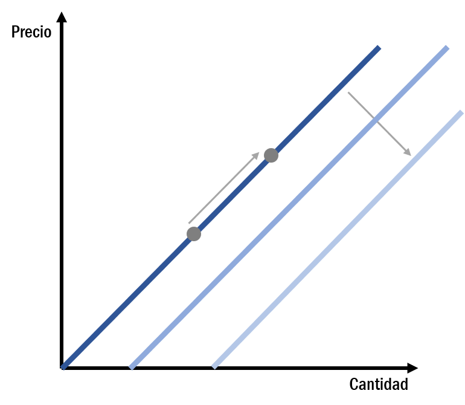
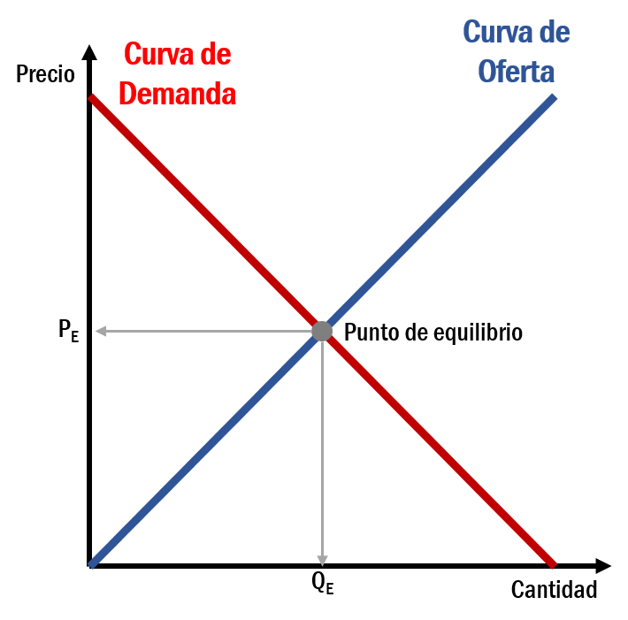

# Oferta y demanda

La oferta y la demanda son dos conceptos recurrentes que aparecen cuando hablamos de economía. Son las dos fuerzas o palancas que hacen que las economías de mercado funcionen. La oferta y la demanda determinan la cantidad que se produce de cada bien y el precio al que debe venderse. Y esto lo hacen al interactuar en los mercados. El mercado de un producto está formado por todos los vendedores y compradores de un producto, y por lo tanto, por su oferta y su demanda.

## La demanda

La demanda es la cantidad que los consumidores (compradores) desean y pueden comprar en funcion del precio.

> **LEY DE LA DEMANDA**:
Manteniéndose todo lo demas constante (*ceteris paribus*), cuando aumenta el precio de un bien, la demanda baja.

La demanda de mercado de un determinado bien es la suma de todas las demandas individuales que lo integran.

La razón por la que cuando el precio del bien aumenta la cantidad demandada por todos los consumidores disminuye es doble. Por un lado, cuando aumenta el precio de un bien algunos consumidores que previamente lo adquirían dejarán de hacerlo o lo comprarán en menor cuantía y buscarán otros bienes que lo sustituirán. Esto se conoce como efecto sustitución, en el sentido de que el bien o servicio que se encarece relativamente tiende a ser sustituido por otros que ahora resultan más baratos.

Por otro lado, los consumidores cuando un bien se encarece demandarán menos unidades del mismo porque la elevación del precio ha reducido la capacidad adquisitiva de la renta, y esto hará que se pueda comprar menos de todos los bienes y, en particular, del que estamos considerando. Este hecho se conoce como el efecto renta, e indica que un incremento en los precios de un bien, disminuye la capacidad adquisitiva de los consumidores para un nivel de renta dado. Ante esta circunstancia los consumidores se verán motivados a reducir la compra de todos los bienes o servicios.

### La curva de demanda
La curva de demanda (Figura \@ref(fig:12a-01)) es la representación gráfica de la relación entre el precio de un bien y la cantidad demandada. Al trazar la curva de demanda suponemos que se mantienen constantes los demás factores, excepto el precio, que puedan afectar a la cantidad demandada.

```{r 12a-01, echo=FALSE, out.width = "50%", fig.align = 'center', fig.cap = "Curva de demanda"}
knitr::include_graphics('images/12a-01.png')
```

La función de demanda es una relación matemática que recoge la relación entre la cantidad demandada de un bien, su precio y otras variables.

### Movimientos de la curva de demanda
Cuando varía el precio de un bien, el desplazamiento se produce a lo largo de la curva de demanda Sin embargo, la curva de oferta se desplaza cuando se altera cualquiera de los factores que inciden en la demanda distinto del precio (Figura \@ref(fig:12a-02)):

* La renta o ingreso de los consumidores (léase *bienes normales* o *bienes inferiores*).
* Los precios de los bienes relacionados (léase *bienes complementarios*, *bienes sustitutivos* o *bienes independientes*).
* Los gustos o preferencias de los consumidores.
* El tamaño del mercado o el número de consumidores.

```{r 12a-02, echo=FALSE, out.width = "50%", fig.align = 'center', fig.cap = "Movimientos a lo largo de la curva y de la curva de demanda"}
knitr::include_graphics('images/12a-02.png')
```

## La oferta

La oferta es la cantidad que los productores (vendedores) quieren y pueden vender a los distintos precios.

> **LEY DE LA OFERTA**:
Manteniéndose todo lo demas constante (*ceteris paribus*), cuando aumenta el precio de un bien, la oferta aumenta.

La oferta de mercado de un determinado bien es la suma de todas las oferta individuales que lo integran.

### La curva de oferta
La curva de oferta (Figura \@ref(fig:12a-03)) es la representación gráfica de la relación entre el precio de un bien y la cantidad ofrecida. Al trazar la curva de oferta suponemos que se mantienen constantes las demás variables, excepto el precio, que puedan afectar a la cantidad ofertada.

```{r 12a-03, echo=FALSE, out.width = "50%", fig.align = 'center', fig.cap = "Curva de oferta"}
knitr::include_graphics('images/12a-03.png')
```

La función de oferta es una relación matemática que recoge la relación entre la cantidad demandada de un bien, su precio y las demás variables que influyen en las decisiones de producción.

### Movimientos de la curva de oferta
Cuando varía el precio de un bien, el desplazamiento se produce a lo largo de la curva de oferta. Sin embargo, la curva de oferta se desplaza cuando se altera cualquiera de los factores que inciden en la oferta distinto del precio (Figura \@ref(fig:12a-04)):

* El precio de los factores productivos.
* La tecnología existente.
* El número de empresas existentes en el mercado.

```{r 12a-04, echo=FALSE, out.width = "50%", fig.align = 'center', fig.cap = "Movimientos a lo largo de la curva y de la curva de oferta"}

```

## El punto de equilibrio

Cuando consumidores y productores se ponen en contacto para intercambiar un bien, cada uno de ellos con sus respectivas curvas de demanda y oferta, existe un punto en el que ambos agentes se ponen de acuerdo. Existen multitud de precios en los que los planes de cada uno de ellos no coinciden, pero existe un único punto en el que se da la coincidencia. Este es el punto de equilibrio del mercado y nos proporciona información sobre la cantidad (demandada y ofertada) y el precio de equilibrio.

> **Punto de equilibrio**:
Es el punto en el que coinciden oferta y demanda. El precio de equilibrio es aquel en el cual la cantidad demandada es igual a la cantidad ofertada, siendo ésta la cantidad de equilibrio.

```{r 12a-05, echo=FALSE, out.width = "50%", fig.align = 'center', fig.cap = "Punto de equilibrio entre la curva de oferta y la curva de demanda"}

```

En el punto de equilibrio, dado que los deseos de los consumidores y de los productores coinciden, no hay escasez ni excedente del bien.
Un exceso de oferta o excedente, es la situación en la que la cantidad ofrecida es mayor que la demandada.
Un exceso de demanda o escasez, es la situación en la que la cantidad demandada es mayor que la ofrecida.

Si a partir de una posición de equilibrio tienen lugar desplazamientos simultáneos de las curvas de demanda y de oferta, el impacto sobre el precio y la cantidad de equilibrio será ambiguo pues dependerá de la magnitud del cambio experimentado por cada una de las curvas.
