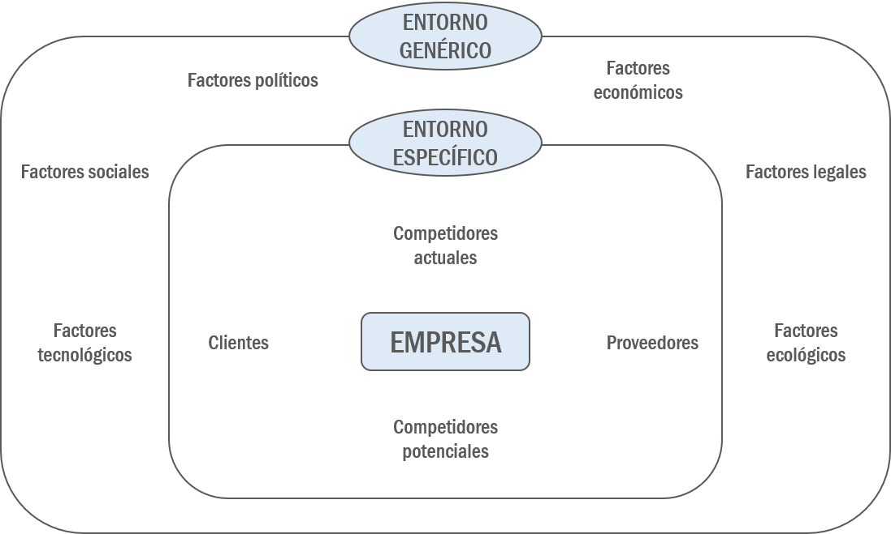
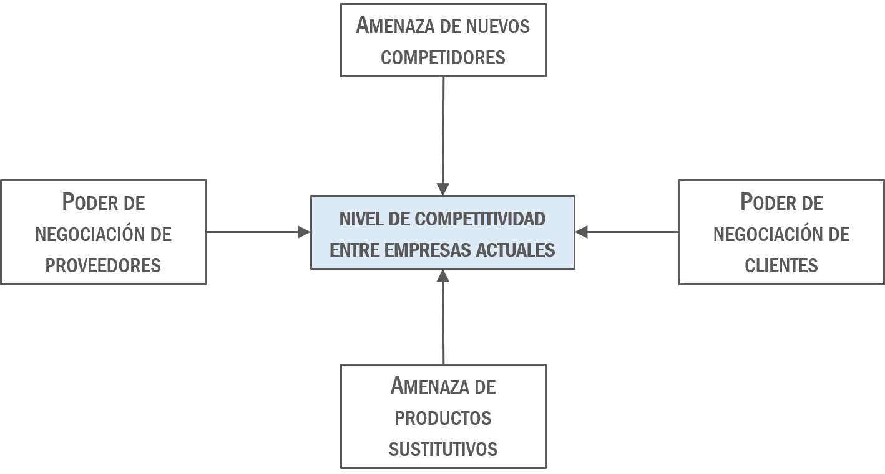

# El entorno económico de la empresa

La empresa, en el desempeño de su actividad, interactúa constantemente con el entorno que la rodea, ya sea en el mercado de factores productivos, con trabajadores, proveedores y acreedores, así como en el mercado de productos y servicios finales, fundamentalmente con clientes y competidores. Además, la empresa, como el resto de instituciones, organizaciones y personas físicas, se encuentra dentro de un sistema económico, social, cultural, político o legal que condiciona su comportamiento.

Por todo ello, resulta fundamental definir y comprender el funcionamiento del entorno que rodea a la empresa con el objetivo de aprovechar las oportunidades que éste plantea, así como evitar o neutralizar sus amenazas. En sentido amplio, el entorno de la empresa se define como todas aquellas características ajenas a la empresa que ésta no puede controlar, pero que influyen o pueden influir en su actividad, comportamiento y resultados, presentes y futuros.

```{r 18a-01, echo=FALSE, out.width = "50%", fig.align = 'center', fig.cap = "El entorno económico de la empresa"}

```

Con el objetivo estudiar con más detalle el entorno empresarial se diferencian dos niveles de entorno: el entorno general y el entorno específico. El entorno general abarca los factores socioeconómicos, mientras que el entorno específico se identifica con factores relativos al sector donde la empresa compite. En la Figura \@ref(fig:18a-01) se proponen los principales aspectos incluidos en estos dos niveles del entorno empresarial.

## El entorno genérico

El entorno general de la empresa se define como el conjunto de variables y factores que desde diferentes ámbitos -económico, político, legal, cultural, social, ecológico, etc.- afecta o puede afectar a todos los agentes económicos y sociales, y por ende, a las empresas, de una determinada sociedad, país o área geográfica determinada.

Para llevar a cabo el análisis del entorno general resulta ampliamente utilizado el denominado análisis PESTEL [@johnson2007] que incluye factores del entorno general agrupados bajo las dimensiones Política, Económica, Social, Tecnológica, Ecológica y Legal. Cada uno de ellos debe aplicarse al ámbito geográfico de las actividades de la empresa.

* La dimensión política incluye las variables que configuran el sistema institucional de un determinado país o área geográfica con capacidad política decisoria. Estas variables delimitan las relaciones jurídicas, sociales y económicas entre los diferentes agentes económicos y sociales. Aspectos como el sistema político existente (democrático u otro), la independencia y desarrollo del sistemajudicial, la estabilidad institucional del Estado, el nivel de intervencionismo de las Administraciones Públicas, o la estabilidad del gobierno, son aspectos importantes a considerar por parte de las empresas.
* La dimensión económica engloba aquellas variables macroeconómicas que configuran la situación económica actual y futura de una determinada área geográfica. Entre las variables más representativas, encontramos datos de crecimiento del producto interior bruto (PIB), tasa de desempleo, tipos de interés, tasa de inflación o datos sobre consumo privado, entre otras.
* La dimensión social incluye variables de carácter social, cultural y demográfico. La tasa de natalidad, esperanza de vida, inmigración, nivel educativo de la población, estilos de vida o la aparición de nuevos valores aceptados por la sociedad, son algunos ejemplos de variables incluidas por las empresas para valorar esta dimensión.
* La dimensión tecnológica básicamente se mide por la existencia de infraestructura y desarrollo tecnológico existente, presupuesto público y/o privado dedicado a actividades de investigación, desarrollo e innovación (1+D+i).
* La dimensión ecológica del entorno se refiere al nivel de sensibilización de una sociedad, sus organizaciones políticas, gubernamentales o sociales hacia el medioambiente. Los alimentos transgénicos, la producción contaminante, el consumo energético sostenible o el reciclado de residuos y envases son aspectos que se manifiestan cada vez con mayor ímpetu en diferentes aspectos de una sociedad, que se deberán atender y tener en cuenta por parte de la actividad y comportamiento de la empresa.
* La dimensión legal se refiere a la definición del marco laboral, comercial, financiero o de defensa de la competencia. Está íntimamente ligada a la dimensión política. En este sentido, las leyes para el libre comercio de la Unión Europa o Nafta van más allá de las variables políticas de cada país concreto.

Cada empresa deberá seleccionar aquellas variables, dentro de cada dimensión, que sean más relevantes para su actividad empresarial. A partir de la información y datos disponibles, la dirección identificará posibles amenazas a evitar y oportunidades a tener en cuenta en sus actuaciones empresariales. Cabe destacar en este sentido, que una variable puede resultar una amenaza para un determinado sector de actividad y puede constituirse en una oportunidad para otro y no ser relevante para un tercer sector de actividad, e incluso, que dentro de una misma industria, suponga una amenaza para la mayoría de empresas competidoras, pero para una o unas pocas constituya una oportunidad.

## El entorno específico

El análisis del entorno específico o competitivo de la empresa complementa el estudio de los factores externos que influyen o pueden influir en la actividad de la empresa y en sus resultados. El análisis del entorno específico tiene su origen en los estudiosos de la Economía Industrial [@bain1958], los cuales proponen que la estructura de la industria donde opera la empresa condiciona el comportamiento estratégico de ésta y sus competidoras, y por ende, los resultados a obtener.

Lo relevante en el análisis del entorno específico es determinar el grado de atractivo de la industria. Dicho atractivo indicará la probabilidad que la empresa tiene de obtener rentas o beneficios en dicho sector, lo que vendrá determinado por las oportunidades y amenazas que el sector depare para las empresas que están ubicadas en él. Así, una industria será más atractiva cuantos mayores sean los factores que representan oportunidades para las empresas allí instaladas y menores sean los factores que representan amenazas. En caso contrario, hablaremos de industrias poco atractivas.

## Herramientas para el análisis del entorno de la empresa

La técnica o herramienta más empleada para el análisis de la estructura de la industria y su grado de atractivo es el conocido Modelo de las Cinco Fuerzas Competitivas o Modelo de Porter (@porter1982) (Figura \@ref(fig:18a-02)).

```{r 18a-02, echo=FALSE, out.width = "50%", fig.align = 'center', fig.cap = "Modelo de las cinco fuerzas de Porter"}

```

### El análisis de Porter

De acuerdo con este modelo el grado de atractivo de la industria depende de las siguientes cinco fuerzas competitivas:

**Grado de rivalidad de la competencia actual**

Esta fuerza está formada por el conjunto de empresas que son rivales y que, por tanto, compiten con la empresa en la venta de sus productos. Cuanto mayor sea el grado de rivalidad entre los competidores actuales de una determinada industria, menor será su grado de atractivo. Entre los factores que inciden en dicho grado de rivalidad, destacamos los siguientes:

* Número de competidores. Cuanto mayor sea el número de empresas competidoras existentes en una industria y más compensado esté su tamaño relativo, mayores incentivos existen a la confrontación directa para ganar cuota de mercado, y por tanto, mayor resultará el grado de rivalidad de la competencia actual.
* Crecimiento de la demanda. En industrias donde la demanda está estancada, las empresas se ven forzadas a una mayor rivalidad, tratando de conseguir clientes de la competencia para aumentar sus ventas. Por el contrario, cuando la demanda agregada de una industria crece mucho, la rivalidad se reduce porque las empresas incrementan sus ventas directamente de los nuevos clientes que van apareciendo o por la mayor demanda de los existentes.
* Grado de diferenciación. Cuando los productos que los diferentes competidores ofrecen son homogéneos o estandarizados la competencia es más dura y se suele centrar en ofrecer un precio atractivo. No obstante, cuando los productos de la industria se pueden diferenciar a través de distintas prestaciones, marca, servicios, garantías, calidad, etc., cada empresa puede centrarse en un tipo de producto y la competencia se atenúa.
* Tamaño mínimo eficiente elevado. Cuando en la industria es importante tener un gran tamaño para empezar a competir y ofrecer productos a precios competitivos, las empresas tienen que realizar un elevado volumen de inversiones y con objeto de recuperarlas lanzan al mercado gran cantidad de los productos, incidiendo de esta manera en un aumento en el grado de rivalidad de la competencia actual.
* Existencia de barreras de salida. Las barreas de salida se refieren a la imposibilidad real que pueden llegar a tener las empresas para cesar sus actividades y abandonar el mismo. Suele ocurrir en negocios que no tienen futuro en el sector, y las barreras de salida pueden ser instalaciones específicas que impiden su adecuada venta o reutilización, factores emocionales que impiden el abandono, tener que despedir a muchas personas, etc. En la medida en que existan barreras de salida y éstas impidan de manera efectiva la salida «natural» de las empresas peor dotadas, el grado de rivalidad de los competidores actuales de una industria aumentará.

**Amenaza de entrada de nuevos competidores**

Además de conocer el grado de rivalidad de las empresas competidoras actuales de una industria, resulta conveniente analizar la amenaza de entrada de nuevas empresas competidoras, que en caso de producirse, vendrían a aumentar dicha rivalidad, deteriorando el grado de atractivo de la industria. Esta amenaza viene determinada fundamentalmente por:

* Existencia de barreras de entrada. Se refiere a la existencia de obstáculos, como la necesidad de tener una marca consolidada, un gran volumen de producción, licencias administrativas, etc., que impiden la entrada libre a nuevos competidores a un determinado sector de actividad o industria. Pueden entenderse como desventajas que las empresas que quieren entrar tienen frente a las ya establecidas. Desventajas que, al margen de factores políticos, pueden subsanarse pero implican tiempo e inversión económica para las empresas. Cuantas mayores sean estas barreras de entrada, más dilicil será la entrada de nuevos rivales en la industria.
* Reacción de las empresas competidoras ya instaladas. Este factor puede tener un resultado similar a la existencia de las barreras de entrada, en tanto exista una fuerte y dura reacción de las empresas ya instaladas en el sector hacia los nuevos entrantes. Estas reacciones pueden ser aumentar la gama de productos, reducir los márgenes sobre ventas iniciando «una guerra de precios», establecer negociaciones en exclusiva con sus distribuidores, aumentar los servicios complementarios, etc.

**Amenaza de productos sustitutivos**

Los productos sustitutivos son productos que satisfacen las mismas necesidades que los de la empresa, si bien utilizan otra tecnología, es decir, suelen provenir de otro sector. Por ejemplo, un producto sustitutivo de los viajes en avión puede ser el tren. Sin duda, el grado en que un producto es más o menos sustitutivo depende de los clientes, de cómo lo valoren y del precio que cada uno tiene. Ahora bien, cuanto más amenaza exista de la aparición de productos sustitutivos, menos atractivo será el sector.

Esta fuerza estará limitada por la existencia de costes de cambio por parte de los clientes, es decir, de lo fácil o barato que resulte a éstos cambiar del producto actual al producto sustitutivo. Así por ejemplo, el cambio de una compañía de teléfono a otra se vio durante un tiempo limitado porque los usuarios perdían su número de teléfono. Cuantos mayores sean los costes de cambio, menor será la amenaza de productos sustitutivos.

**Poder de negociación de clientes**

Esta fuerza hace referencia al grado en el cual los clientes de una determinada industria tienen poder relativo para negociar precios y demás aspectos relevantes del proceso de compra, imponiendo unas condiciones de intercambio favorables a ellos. En este sentido, cuanto mayor sea su poder de negociación, menor será el grado de atractivo de la industria. Entre los factores que condicionan dicho poder de negociación, se encuentran los siguientes:

* Grado de concentración e importancia de los clientes en relación con la industria. Cuando los clientes de la industria son muy pocos, estando concentradas las ventas de la industria en unos pocos clientes, las empresas de la industria tienen pocas alternativas para vender sus productos, por lo que el poder negociador se reduce en beneficio de sus clientes.
* Grado de diferenciación de los productos objeto de la transacción. Cuando en la industria se ofrecen productos altamente valorados por los clientes debido a sus características únicas, los clientes tendrán una mayor dependencia hacia la industria y su poder de negociación se reducirá.
* Otros aspectos importantes son el grado de información sobre la transacción que tengan los clientes, influyendo positivamente en su poder de negociación frente a las empresas de la industria, así como la amenaza real de integración hacia atrás (posibilidad real de que un cliente se convierta en su propio proveedor y por lo tanto no necesite de las empresas de la industria).

**Poder de negociación de proveedores**

Los factores que explican el poder negociador de los proveedores frente a las empresas de la industria son, en esencia, similares a los comentados en relación con el poder de negociación de los clientes, pero en sentido contrario. Así, el poder negociador de proveedores hace referencia al grado en el cual pueden negociar precios y demás aspectos relevantes del proceso de venta, imponiendo unas condiciones de intercambio favorables a ellos. En este sentido, cuanto mayor sea el poder de negociación de los proveedores, menor será el grado de atractivo de la industria. Entre los factores que condicionan dicho poder de negociación, se encuentran los siguientes:

* Grado de concentración e importancia de los proveedores en relación con la industria. Cuando los proveedores de la industria son muy pocos, estando concentradas las compras de la industria en unos pocos proveedores, las empresas de la industria tienen pocas alternativas para comprar sus materias primas y otros inputs, por lo que el poder negociador se reduce en beneficio de sus proveedores.
* Grado de diferenciación de los productos objeto de la transacción. Cuando los proveedores ofrecen productos altamente valorados por las empresas de la industria debido a sus características únicas, las empresas compradoras tendrán una mayor dependencia hacia los proveedores y su poder de negociación se reducirá.
* Otros aspectos importantes son el grado de información sobre la transacción que tengan los proveedores, influyendo positivamente en su poder de negociación frente a las empresas de la industria, así como la amenaza real de integración hacia delante de los mismos (posibilidad real de que un proveedor se convierta en su propio cliente y por lo tanto no necesite de las empresas de la industria).

### El análisis DAFO

Texto.